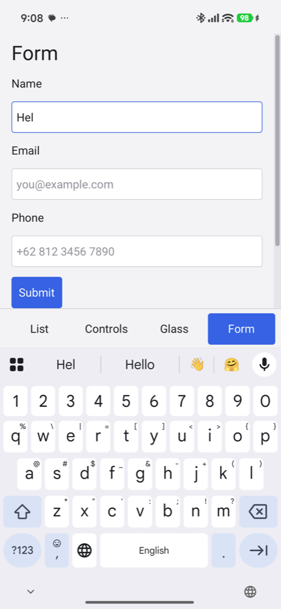

# Raven on iOS and Android (experimental)

One UI written in C, `shared/showcase.c` with its layout in
`shared/assets/showcase.xml`, run by two small apps:

| Folder | What it is |
|---|---|
| `shared/` | The showcase: a bottom tab bar with List (1,000 rows and a detail page), Controls (counter, switch, slider, progress, dialog, toast), Glass (blur over a picture), Form (text fields with keyboard types) and Device (permissions, camera, pickers, haptics, links, sharing, clipboard, an image from the network) |
| `shared/assets/` | The files the app reads at run time: the layout and the picture |
| `ios/` | The iOS app: `src/main.m` (UIKit scene, `CADisplayLink` that drives `Rdraw_frame`), `Info.plist`, `build.sh` |
| `android/` | The Android app: `main.c` (`android_main`, NativeActivity), `AndroidManifest.xml`, `build.sh` |
| `desktop/` | The same UI in a desktop window (`raven_mobile`, built with the other examples): to work on it without a phone; `raven_mobile --check` runs the Device tab without a window |

Both build scripts compile Raven itself with CMake, then the app by hand, so no
Xcode project and no Gradle are needed. The Android script builds Raven's AAR
and makes the APK from it; the iOS script can link Raven.xcframework instead of
its own build (see [Packaging](#packaging)).

## Files of the app

On Android and iOS a relative path that names no file held in memory
(`Rfile_register_memory`) and no file on disk is read from the app's package:
the APK's `assets/` folder (through the `AAssetManager`) or the resources of
the iOS bundle (`[NSBundle mainBundle].resourcePath`). It works for every file
Raven reads: `Rwidget_create_from_xml_file("showcase.xml")`, `Source="photo.png"`,
`Font="fonts/..."`, `Rtexture_create_from_file`, `Rfont_create_from_file`,
`Rfile_read`, themes and translation tables. Paths inside a document are relative
to its folder, as on a desktop. The package is read-only, is not watched for live
reload, and its folders are not listed, so the automatic loading of widget
declarations and translation tables found beside a document does not look into it
(register them by name instead).

Both build scripts put `shared/assets/` into the package (`aapt2 link -A` on
Android, a copy into `Hello.app` on iOS), with the font of the titles copied from
`tools/designer/fonts` into `fonts/`.

| iOS Simulator | | | Android (Xiaomi 15T) | Android emulator |
|---|---|---|---|---|
|  |  |  |  |  |

## The Device tab and what the apps declare

The Device tab calls the services of `raven_device.h`: the status of the camera,
notification and location permissions and a button to ask for each (the
location itself is not read: Raven has no API for it), a notification,
the Settings of the app, taking a photo and picking one from the library (shown
with its size), picking a file (its name and size, the picture when it is one)
and saving a small text file, the seven haptics, opening Raven's page, the
share sheet (with the last photo), copy and paste, and an image downloaded
from `https://raw.githubusercontent.com/...` (Raven's logo). Every answer comes
later, in a callback, and shows in the line under the title. Where the platform
does not have a service yet, its button answers "not supported here (yet)".

On a desktop (`raven_mobile`) the file buttons use the file dialogs, the image
is downloaded with `curl` (WinHTTP on Windows), Open and Copy / Paste work, and
the camera, the share sheet and the haptics are not supported.

What the apps declare for it, so that the platforms can implement the services
without touching them:

| | Android (`AndroidManifest.xml`) | iOS (`Info.plist`) |
|---|---|---|
| Images from `https://` | `INTERNET` (granted at install, no question) | nothing (`http://` would need `NSAppTransportSecurity`) |
| Camera | `CAMERA` (asked at run time; once declared, the camera app may only be used when granted), `uses-feature android.hardware.camera.any` not required, `<queries>` for `IMAGE_CAPTURE` | `NSCameraUsageDescription` |
| Photo library | nothing (the photo picker) | nothing (`PHPickerViewController`); `NSPhotoLibraryUsageDescription` for `R_PERMISSION_PHOTOS`, `NSPhotoLibraryAddUsageDescription` for "Save Image" in the share sheet |
| Notifications | `POST_NOTIFICATIONS` (asked at run time, Android 13+) | nothing |
| Location | `ACCESS_FINE_LOCATION` and `ACCESS_COARSE_LOCATION` (asked at run time; the user may allow the approximate location only: limited) | `NSLocationWhenInUseUsageDescription` |
| Haptics | `VIBRATE` (granted at install) | nothing |
| Files, open URL, share, clipboard | nothing | nothing |
| Raven's Java | `raven.android.RavenRequestActivity` (asks for permissions, receives the answers of the pickers and the camera) and `raven.android.RavenFileProvider` (authority `<package>.raven.files`: files for other apps) | |

The full list of what each service needs, and how the platforms implement
them, is in `docs/device-services.md`.

This is an early stage port: see the platform sources
(`src/platform/uikit/uikit_platform.m`, `src/platform/android/`) and grep for
`SHORTCUT` for the places that are known to be simplified.

## iOS (Simulator)

Needs Xcode with an iOS Simulator runtime, CMake and Ninja. Raven draws with
Metal (`-DRAVEN_BACKEND_VULKAN=OFF`): MoltenVK is not needed.

Boot a simulator, then `cd ios && ./build.sh run`. `UDID=<id>` picks another
one than the booted simulator.

The simulator treats the Mac's keyboard as a hardware keyboard by default and
then shows no on-screen keyboard: turn "Connect Hardware Keyboard" off in the
Simulator to see it.

Testing hooks in `src/main.m`, set at launch with `SIMCTL_CHILD_` in front:
`RAVEN_ROTATE=landscape,portrait` (with `RAVEN_ROTATE_EVERY=<seconds>`)
rotates the scene, `RAVEN_DISMISS=<seconds>` closes the keyboard from outside
Raven, `RAVEN_MEMORY_WARNING=<seconds>` posts UIKit's memory warning.
`RAVEN_DEVICE_TEST=photos,export,clipboard,location,haptic` (with
`RAVEN_DEVICE_TEST_AFTER=<seconds>`) runs services without a tap: asks for the
photo library, exports `photo.png` with `Rfile_export_async`, checks
`Rclipboard_has_text` (no "Allow Paste" question), asks for the location,
reads `Rhaptic_is_supported`, and logs the answers. The Simulator's questions
can be answered from the command line too:
`xcrun simctl privacy booted grant location dev.raven.ios.hello`. `RAVEN_DEVICE_LOG=1` makes the platform log
what it asks of the system (`Raven device: ...`): the haptics play nothing in
the Simulator, the log shows they were asked.

The Device tab in the Simulator: there is no camera (`Rcamera_is_available`
is false, "Take a photo" answers "not supported here"); the photo picker
shows the Simulator's sample photos (the HEIC one comes as a JPEG); files are
saved to and picked from "On My iPhone"; `xcrun simctl privacy <udid> reset all
dev.raven.ios.hello` forgets the answers about the camera and the photos, and
uninstalling the app those about notifications. The Settings button opens
the Settings app at its first page in the iOS 26 Simulator, not at the app's
page.

`XCFRAMEWORK=1 ./build.sh run` links the simulator slice of
`Raven.xcframework` (built first by `tools/mobile/build-xcframework.sh`) instead
of the script's own CMake build; `XCFRAMEWORK=<path>` uses a given one.

### A real iPhone or iPad

`./build.sh device` builds `Hello.app` for `ios-arm64` (the `iphoneos` SDK, CMake
build in `build-ios-device`). It compiles
and links; it has not run on a device yet, because that needs an Apple
developer account:

1. A signing identity (`security find-identity -v -p codesigning`, made by
   Xcode from the account) and a provisioning profile (`.mobileprovision`) that
   allows the bundle id and the device. With a free account, let Xcode make
   one for a bundle id of your own and pass it as `BUNDLE_ID`.
2. `SIGN_IDENTITY="Apple Development: ..." PROFILE=<profile> BUNDLE_ID=<id>
   ./build.sh device` signs the app with the entitlements of the
   profile.
3. `DEVICE=<id of xcrun devicectl list devices> ... ./build.sh device run`
   installs and launches it (`xcrun devicectl`), with the device in developer
   mode.

Steps 2 and 3 are written but untested.

## Android

Needs the Android SDK with an NDK, build tools and a platform (API 29 or
later), a JDK (for `javac` and `d8`), CMake and Ninja. The script takes the
newest NDK, build tools and platform it finds in `$ANDROID_HOME` (default
`~/Library/Android/sdk`); `ANDROID_NDK`, `ANDROID_BUILD_TOOLS` and
`ANDROID_JAR` override them.

`cd android && ./build.sh install` builds `raven-hello.apk` (arm64-v8a,
signed with a debug key made on the first build) and starts it on the device
`adb` sees (`ANDROID_SERIAL` picks one).

The script builds Raven as `libraven.so` and its AAR with CMake
(`RAVEN_BUILD_SHARED=ON`, target `raven_aar`), then makes the APK from it: the
app's `libravenhello.so` (`main.c`, the showcase and `native_app_glue`) links
the AAR's `libraven.so`, both go into `lib/arm64-v8a/`, and `classes.dex` is
Raven's Java part as CMake dexed it.

Raven's Java part, the `InputConnection` of the on-screen keyboard and the
`AccessibilityNodeProvider` that TalkBack reads (`src/platform/android/java`),
is in the APK's `classes.dex`. Without it Raven falls back to key events (no
suggestions, ASCII only) and has no screen reader.

An emulator whose device has a hardware keyboard (`hw.keyboard=yes`) only
shows Gboard's small toolbar, not the full keyboard.

## Packaging

Raven for app developers, made from the same sources: an AAR for Android and
an xcframework for iOS. Both are experimental.

### Android: the Java part and the AAR

With the NDK toolchain, CMake also compiles Raven's Java part
(`src/platform/android/java`) with `javac` and `d8`: the target `raven_java`,
built by default, leaves `<build>/android/classes.jar` and
`<build>/android/classes.dex`. It takes the SDK from `ANDROID_HOME`,
`ANDROID_SDK_ROOT` or the SDK that holds the NDK, its newest build tools and
platform, and `javac` from `JAVA_HOME` or the `PATH`; `RAVEN_ANDROID_SDK`,
`RAVEN_ANDROID_BUILD_TOOLS` and `RAVEN_ANDROID_JAR` override them. When a tool
is missing, CMake warns and skips the Java part and the AAR (libraven still
builds); `-DRAVEN_ANDROID_JAVA=OFF` skips them without the warning.
`libraven.so` is linked for 16 KB pages (`-z max-page-size=16384`).

`cmake --build <build> --target raven_aar` (with `-DRAVEN_BUILD_SHARED=ON`)
packs `<build>/raven-<version>-<abi>.aar` for the ABI of that build, and

    tools/mobile/build-android-aar.sh [abi ...]    # default: arm64-v8a x86_64

builds one per ABI and merges them into `build-aar/raven-<version>.aar`:

```
raven-0.2.3.aar
├── AndroidManifest.xml          package raven.android, minSdk 29
├── classes.jar                  Raven's Java part
├── proguard.txt                 R8 keeps what libraven.so calls by name
├── R.txt                        empty (no resources)
├── jni/
│   ├── arm64-v8a/libraven.so
│   └── x86_64/libraven.so
└── prefab/                      the same libraries with the headers
    ├── prefab.json
    └── modules/raven/
        ├── module.json
        ├── include/             Raven.h, raven/
        └── libs/android.<abi>/  abi.json, libraven.so
```

A Gradle app (not tried here: no Gradle in this setup) adds the AAR and
builds its own native code, the `android_main` with `native_app_glue`,
against it with prefab:

```kotlin
// app/build.gradle.kts
android {
    defaultConfig { minSdk = 29 }
    buildFeatures { prefab = true }
    externalNativeBuild { cmake { path = file("src/main/cpp/CMakeLists.txt") } }
}
dependencies { implementation(files("libs/raven-0.2.3.aar")) }
```

```cmake
# src/main/cpp/CMakeLists.txt
find_package(raven REQUIRED CONFIG)
add_library(app SHARED main.c ${ANDROID_NDK}/sources/android/native_app_glue/android_native_app_glue.c)
target_include_directories(app PRIVATE ${ANDROID_NDK}/sources/android/native_app_glue)
target_link_libraries(app raven::raven android log)
target_link_options(app PRIVATE -uANativeActivity_onCreate)
```

The manifest declares `android.app.NativeActivity` with
`<meta-data android:name="android.app.lib_name" android:value="app" />`, as
`android/AndroidManifest.xml` does. Gradle packs `libraven.so` from the AAR's
`jni/` next to `libapp.so`, the dynamic linker finds it there when
NativeActivity loads `libapp.so`, and `classes.jar` goes into the app's dex
with the consumer rules applied. Without Gradle, do what `android/build.sh`
does: link with `-lraven` against the AAR's `libraven.so`, put both libraries
in the APK's `lib/<abi>/` and dex `classes.jar` (or take CMake's
`classes.dex`).

GameActivity is not supported yet: Raven is written against the NDK's
`android_native_app_glue` (`struct android_app`, `onInputEvent`), and
GameActivity brings its own glue with another `android_app`.

### iOS: Raven.xcframework

    tools/mobile/build-xcframework.sh [output folder]    # default: build-xcframework

builds `libraven.a` for devices and for the Simulator with CMake and joins them
with `xcodebuild -create-xcframework` (`CONFIG`, `MIN_IOS`, default 15.0, and
`SIM_ARCHS`, default `arm64;x86_64`, change the build):

```
Raven.xcframework
├── Info.plist
├── ios-arm64/
│   ├── libraven.a
│   └── Headers/                 Raven.h, raven/, module.modulemap (module Raven)
└── ios-arm64_x86_64-simulator/
    ├── libraven.a               arm64 + x86_64
    └── Headers/
```

In Xcode, add `Raven.xcframework` to the target (Frameworks, Libraries, and
Embedded Content: "Do Not Embed", it is a static library), and link the
system frameworks Raven uses: Foundation, CoreFoundation, UIKit, QuartzCore,
Metal, CoreText, CoreGraphics, and for the services of the device
(`raven_device.h`) AVFoundation, Photos, PhotosUI, UniformTypeIdentifiers,
UserNotifications, ImageIO, CoreLocation (the module map links them, and `libobjc`, by
itself for `import Raven` and `@import Raven;`). C and Objective-C include `<Raven.h>` (or `@import Raven;`),
Swift does `import Raven`. Raven draws with Metal, so nothing else is
embedded (no MoltenVK). The app's resources (layouts, pictures, fonts) go into
its bundle, as `ios/build.sh` does.

Raven's minimum is iOS 15 (the UIKit platform checks for the iOS 17 API it
uses, `registerForTraitChanges`, and falls back to `traitCollectionDidChange:`;
it builds without availability warnings at `MIN_IOS=15.0`, but has only run
on iOS 26 Simulators here). The showcase itself (`ios/build.sh`, its
`Info.plist`) asks for iOS 17. A Swift package (`binaryTarget`) is not made yet.
